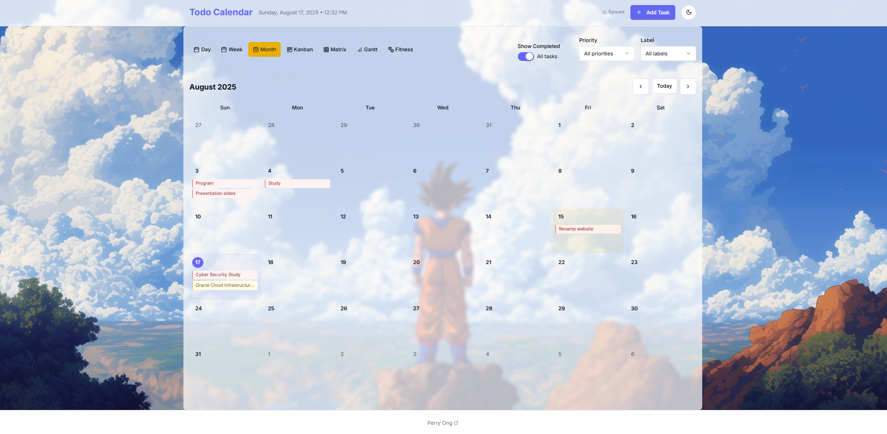
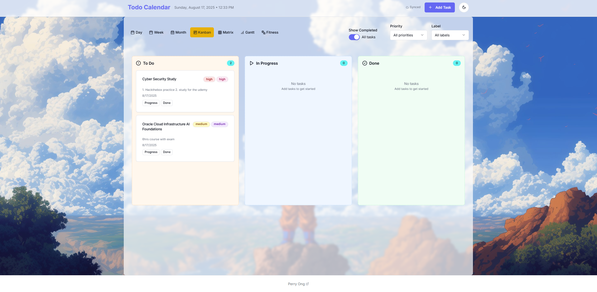
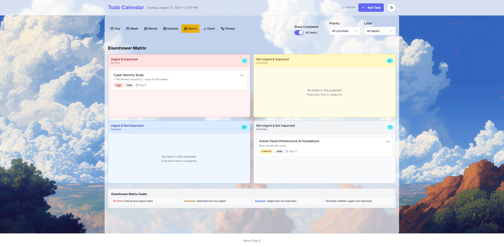
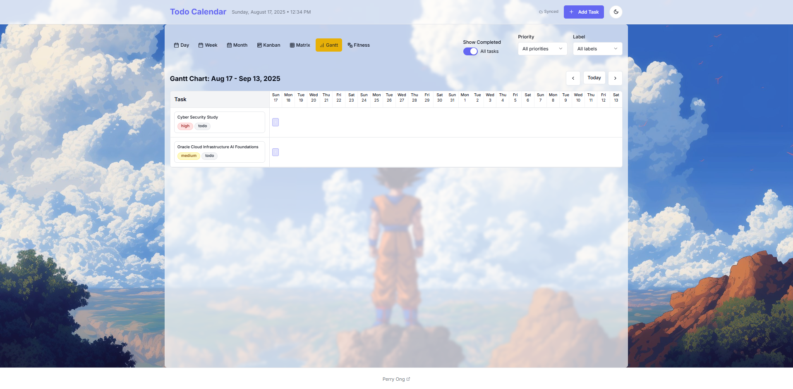

# Smart Task Calendar 📅

A modern, feature-rich task management application built with React, TypeScript, and Tailwind CSS. Manage your tasks across multiple views including calendar, Kanban, Gantt chart, Eisenhower Matrix, and fitness tracking.

## ✨ Features

### 📋 Task Management
- **Create, Edit, and Delete Tasks** - Full CRUD operations with rich task details
- **Priority Levels** - High, Medium, Low priority classification
- **Status Tracking** - Todo, In Progress, Done status management
- **Labels & Categories** - Organize tasks with custom labels
- **Due Dates** - Set and track task deadlines
- **Task Descriptions** - Add detailed notes and context

### 📅 Multiple Calendar Views
- **Day View** - Focus on today's tasks with detailed scheduling
- **Week View** - 7-day overview with horizontal scrolling on mobile
- **Month View** - Traditional calendar layout with task previews
- **Mobile Responsive** - Optimized layouts for all screen sizes



### 🎯 Productivity Views

#### Kanban Board
- **Three Columns** - Todo, In Progress, Done
- **Drag & Drop** - Easy task status updates
- **Visual Progress** - Color-coded priority and urgency badges
- **Timer Integration** - Start/stop timers for in-progress tasks



#### Eisenhower Matrix
- **Four Quadrants** - Urgent/Important classification
- **Drag & Drop** - Reorganize tasks by priority matrix
- **Visual Organization** - Color-coded quadrants for quick identification
- **Productivity Focus** - Based on proven time management principles



#### Gantt Chart
- **Timeline Visualization** - 4-week project timeline view
- **Progress Tracking** - Visual progress bars for each task
- **Duration Management** - Estimated vs actual time tracking
- **Dependency Planning** - Visual task scheduling



### 💪 Fitness Tracking
- **Activity Logging** - Track various fitness activities
- **Multiple Activity Types** - Cardio, Strength, Flexibility, Sports, etc.
- **Intensity Levels** - Low, Medium, High intensity tracking
- **Calorie Tracking** - Log calories burned per activity
- **Weekly Overview** - Visual fitness calendar with activity summaries


### 🎨 User Experience
- **Dark/Light Theme** - Toggle between themes with system preference detection
- **Responsive Design** - Mobile-first approach with touch-optimized interactions
- **Smooth Animations** - Polished transitions and micro-interactions
- **Keyboard Shortcuts** - Efficient navigation for power users
- **Touch Gestures** - Swipe navigation and touch-friendly controls

### 🔧 Advanced Features
- **Smart Filtering** - Filter by priority, completion status, and labels
- **Local Storage** - Persistent data storage in browser
- **Task Statistics** - Progress tracking and completion analytics
- **Export/Import** - Data portability (planned feature)
- **Offline Support** - Works without internet connection

## 🚀 Getting Started

### Prerequisites
- Node.js (v16 or higher)
- npm or yarn package manager

### Installation

1. **Clone the repository**
   ```bash
   git clone https://github.com/Perryong/calendar-task-list.git
   cd smart-task-calendar
   ```

2. **Install dependencies**
   ```bash
   npm install
   # or
   yarn install
   ```

3. **Start the development server**
   ```bash
   npm run dev
   # or
   yarn dev
   ```

4. **Open your browser**
   Navigate to `http://localhost:5173` to see the application.

### Building for Production

```bash
npm run build
# or
yarn build
```

The built files will be in the `dist` directory, ready for deployment.

## 🛠️ Tech Stack

### Frontend Framework
- **React 18** - Modern React with hooks and concurrent features
- **TypeScript** - Type-safe development
- **Vite** - Fast build tool and development server

### Styling & UI
- **Tailwind CSS** - Utility-first CSS framework
- **Radix UI** - Accessible component primitives
- **Lucide React** - Beautiful icon library
- **CSS Variables** - Dynamic theming support

### State Management
- **React Context** - Global state management
- **Custom Hooks** - Reusable stateful logic
- **Local Storage** - Data persistence

### Date & Time
- **date-fns** - Modern date utility library
- **React Day Picker** - Flexible date picker component

### Development Tools
- **ESLint** - Code linting
- **TypeScript** - Type checking
- **Vite** - Build tooling

## 📱 Mobile Features

### Touch Optimizations
- **Swipe Navigation** - Horizontal scrolling for week/month views
- **Touch Targets** - Minimum 44px touch areas for better usability
- **Gesture Support** - Smooth scroll with momentum
- **Responsive Breakpoints** - Optimized layouts for all screen sizes

### Mobile-Specific UI
- **Floating Action Button** - Quick task creation
- **Bottom Sheets** - Mobile-friendly dialogs
- **Horizontal Scroll** - Optimized for touch navigation
- **Compact Views** - Space-efficient layouts

## 🎯 Usage Guide

### Creating Tasks
1. Click the "+" button or use the "Add Task" option
2. Fill in task details (title, description, priority, labels)
3. Set due date and estimated duration
4. Save to add to your task list

### Managing Views
- Use the view selector to switch between Calendar, Kanban, Matrix, and Gantt views
- Each view offers unique ways to organize and visualize your tasks
- Filter tasks by completion status, priority, or labels

### Fitness Tracking
1. Switch to the Fitness view
2. Click "Add Activity" to log workouts
3. Select activity type, duration, and intensity
4. Track your fitness progress over time

### Productivity Features
- **Eisenhower Matrix**: Drag tasks between quadrants to prioritize effectively
- **Kanban Board**: Move tasks through workflow stages
- **Gantt Chart**: Visualize project timelines and dependencies

## 🔄 Data Management

### Local Storage
- All data is stored locally in your browser
- No account required - start using immediately
- Data persists between sessions

### Data Structure
```typescript
interface Task {
  id: string;
  title: string;
  description?: string;
  date: Date;
  priority: 'low' | 'medium' | 'high';
  status: 'todo' | 'in_progress' | 'done';
  urgency: 'low' | 'medium' | 'high';
  completed: boolean;
  labels?: string[];
  estimated_duration?: number;
  started_at?: Date;
  completed_at?: Date;
}
```

## 🎨 Customization

### Themes
- Light and dark themes available
- System preference detection
- Persistent theme selection
- Custom CSS variables for easy customization

### Color Scheme
```css
:root {
  --primary: 239 84% 67%;        /* Blue */
  --secondary: 180 84% 67%;      /* Cyan */
  --accent: 45 93% 47%;          /* Orange */
  --success: 142 71% 45%;        /* Green */
  --warning: 38 92% 50%;         /* Yellow */
  --error: 0 84% 60%;           /* Red */
}
```

## 🤝 Contributing

We welcome contributions! Please see our [Contributing Guide](CONTRIBUTING.md) for details.

### Development Workflow
1. Fork the repository
2. Create a feature branch
3. Make your changes
4. Add tests if applicable
5. Submit a pull request

### Code Style
- Use TypeScript for type safety
- Follow ESLint configuration
- Use Prettier for code formatting
- Write descriptive commit messages

## 📄 License

This project is licensed under the MIT License - see the [LICENSE](LICENSE) file for details.

## 🙏 Acknowledgments

- **Radix UI** - For accessible component primitives
- **Tailwind CSS** - For the utility-first CSS framework
- **Lucide** - For the beautiful icon set
- **date-fns** - For date manipulation utilities
- **React community** - For the amazing ecosystem

## 📞 Support

If you have any questions or run into issues:

1. Check the [FAQ](docs/FAQ.md)
2. Search existing [GitHub Issues](https://github.com/Perryong/calendar-task-list)
3. Create a new issue if needed

## 🗺️ Roadmap

### Upcoming Features
- [ ] Cloud synchronization
- [ ] Team collaboration
- [ ] Task templates
- [ ] Advanced reporting
- [ ] Mobile app (React Native)
- [ ] Integration with external calendars
- [ ] Voice commands
- [ ] AI-powered task suggestions

### Version History
- **v1.0.0** - Initial release with core task management
- **v1.1.0** - Added Kanban and Matrix views
- **v1.2.0** - Fitness tracking integration
- **v1.3.0** - Gantt chart and timeline features

---

**Built with ❤️ by [Perry Ong](https://perryong.github.io/linktree/)**

*Smart Task Calendar - Where productivity meets simplicity*